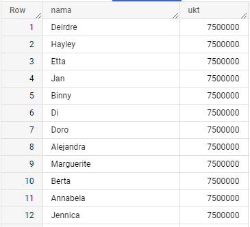
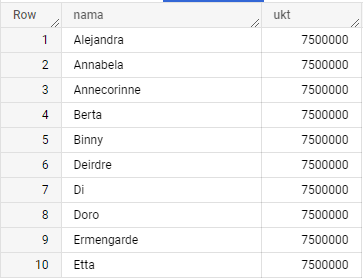
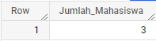
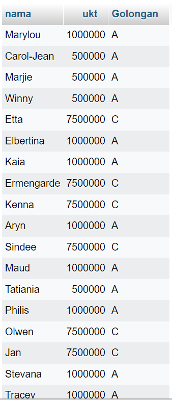
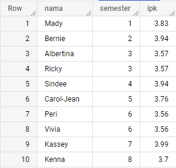

# Modul 1 Oprec MCI 2023: Database & SQL

- [Database](#database)
  - [Konsep](#konsep-database)
  - [Istilah](#istilah-database)
  - [Key](#key-database)
  - [Database Management System (DBMS)](#dbms-database)
- [SQL](#sql)
  - [Tentang](#tentang-sql)
  - [Data Definition Language (DDL)](#ddl-sql)
    - [DDL Database](#ddl-database)
    - [DDL Tabel](#ddl-tabel)
  - [Data Manipulation Language (DML)](#dml-sql)
  - [Latihan](#latihan-sql)
  - [Platform untuk Latihan](#platform-sql)
- [Referensi](#referensi)

# <a name="database"></a>1. Database

## <a name="konsep-database"></a>Konsep Database

### Apa itu database?

<b>Database</b> atau <b>basis data</b> adalah kumpulan data yang dikelola sedemikian rupa berdasarkan ketentuan tertentu yang saling berhubungan sehingga mudah dalam pengelolaannya. Melalui pengelolaan tersebut pengguna dapat memperoleh kemudahan dalam mencari informasi, menyimpan informasi, dan membuang informasi. Perangkat lunak yang digunakan untuk mengelola dan memanggil kueri (<i>query</i>) basis data tersebut disebut dengan sistem manajemen basis data (<i>Database Management System</i>/<b>DBMS</b>).

### <a name="istilah-database"></a>Istilah pada database

- <b>Entitas</b>

  Entitas adalah objek yang mewakili sesuatu dalam dunia nyata dan dapat dibedakan antara satu dengan lainnya (<i>unique</i>). Objek dapat berupa barang, orang, tempat atau suatu kejadian. Misalnya, dosen, mahasiswa, sepeda motor, rumah, pegawai, dan lain-lain.

- <b>Atribut</b>

  Deskripsi/karakteristik dari suatu entitas, berisi penjelasan detail tentang entitas itu sendiri. Misalnya, entitas mahasiswa mempunyai atribut nama, alamat, NRP, <i>email</i>, dan lain-lain.

- <i><b>Field</b></i>

  Tempat atau kolom yang terdapat pada tabel untuk mengisikan salah satu elemen data.

- <i><b>Record</b></i>

  Kumpulan <i>field</i> yang berhubungan satu sama lain dan biasanya dihitung dalam satu baris.

<b>Gambaran untuk membantu memahami istilah pada database</b>


### <a name="key-database"></a>Key pada database

<i>Key</i> adalah elemen <i>record</i> yang dipakai untuk menemukan <i>record</i> tersebut pada waktu akses. <i>Key</i> di dalam database berfungsi sebagai suatu cara untuk mengidentifikasi dan menghubungkan suatu tabel data dengan tabel yang lain. Terdapat beberapa jenis <i>key</i>, yaitu:

- <i><b>Primary key</b></i>

  <i>Field</i> yang mengidentifikasi sebuah <i>record</i> dan bersifat unik (tidak sama atau ganda). <i>Field</i> di sini juga tidak boleh <b>null</b>.

  

- <i><b>Secondary key</b></i>

  <i>Field</i> yang mengidentifikasi sebuah <i>record</i> dan tidak bersifat unik. Biasanya digunakan secara kombinasi dan hanya bertujuan untuk mengambil data.

  

- <i><b>Foreign key</b></i>

  <i>Field</i> yang bukan key, tetapi <i>key</i> pada tabel lain (tabel induk). Digunakan untuk menghubungkan suatu tabel dengan tabel lainnya.

  

### <a name="dbms-database"></a>Database Management System (DBMS)

<b><i>Database Management System</i></b> (DBMS) adalah suatu sistem atau perangkat lunak yang dirancang untuk mengelola suatu basis data dan menjalankan operasi terhadap data yang diminta banyak pengguna.

<b>Contoh DBMS</b>:

- Oracle
- MySQL
- Microsoft Access
- PostgreSQL
- Microsoft SQL Server
- BigQuery

# <a name="sql"></a>2. SQL

## <a name="tentang-sql"></a>Tentang SQL

### Apa itu SQL?

SQL (<i>Structured Query Language</i>) adalah sebuah bahasa yang digunakan untuk mengakses data dalam basis data relasional. SQL dapat digunakan untuk mendefinisikan struktur data, pengubahan data, memanipulasi/memperoleh data, pengaturan sekuritas, dan lain lain. SQL dilafalkan dengan membaca tiap karakternya **S Q L** (Es Qi El) atau **Siquel**.

## <a name="ddl-sql"></a>Data Definition Language (DDL)

DDL digunakan untuk mendefinisikan, mengubah, serta menghapus database dan objek-objek yang diperlukan dalam database atau lebih tepatnya **memanipulasi struktur database**. Dalam implementasinya, DDL digunakan untuk membuat dan memanipulasi tabel maupun <i>view</i>. Terdapat dua macam DDL, yaitu:

### <a name="ddl-database"></a>DDL untuk database

1. <b>CREATE DATABASE</b> untuk membuat database.

   ```MySQL
   CREATE DATABASE mahasiswa;                                     /* Membuat database 'mahasiswa' */
   ```

2. <b>DROP DATABASE</b> untuk menghapus database.

   ```MySQL
   DROP DATABASE mahasiswa;                                       /* Menghapus database 'mahasiswa'*/
   ```

### <a name="ddl-tabel"></a>DDL untuk tabel

1. <b>CREATE TABLE</b> untuk membuat tabel baru pada database.

   ```MySQL
   CREATE TABLE Mahasiswa (                                       /* Membuat tabel 'mahasiswa' dengan 4 atribut */
      NRP VARCHAR(16) NOT NULL,                                   /* NRP tidak NULL */
      Nama VARCHAR(50) NOT NULL,                                  /* Nama tidak NULL */
      Usia INT,
      Semester INT,
      PRIMARY KEY(NRP)                                            /* NRP adalah primary key */
   );
   ```

2. <b>ALTER TABLE</b> untuk memodifikasi atribut pada tabel yang sudah ada (menambah, mengubah, menghapus).

   <b>ADD</b>

   ```MySQL
   ALTER TABLE Mahasiswa
   ADD Tanggal_Lahir date;                                        /* Menambah atribut baru 'Tanggal_Lahir' */
   ```

   <b>DROP COLUMN</b>

   ```MySQL
   ALTER TABLE Mahasiswa
   DROP COLUMN Usia;                                              /* Menghapus atribut 'Usia' */
   ```

   <b>MODIFY COLUMN</b>

   ```MySQL
   ALTER TABLE Mahasiswa
   MODIFY COLUMN NRP VARCHAR(14);                                 /* Mengubah tipe data atribut NRP menjadi VARCHAR(14) */
   ```

3. <b>RENAME TABLE</b> untuk mengganti nama tabel pada database.

   ```MySQL
   RENAME TABLE Mahasiswa TO Mhs;                                 /* Mengganti nama tabel 'Mahasiswa' menjadi 'Mhs' */
   ```

4. <b>DROP TABLE</b> untuk menghapus tabel pada database.
   ```MySQL
   DROP TABLE Mhs;                                                /* Menghapus tabel 'Mhs' */
   ```

## <a name="dml-sql"></a>Data Manipulation Language (DML)

DML digunakan untuk memanipulasi data yang ada dalam suatu tabel. Berisi berbagai perintah yang dapat digunakan untuk menyisipkan data (INSERT), mengambil data atau query (SELECT), mengubah data (UPDATE) dan menghapus data (DELETE). Beberapa kuerinya antara lain:

1. <b>INSERT</b> untuk memasukkan <i>record</i> baru pada tabel.

   ```MySQL
   INSERT INTO Mahasiswa(NRP, Nama, Usia, Semester)
   VALUES('5025201094', 'Reyner', 20, 6);
    /* Menambahkan record yang atributnya
    NRP : 5025201094
    Nama : Reyner
    Usia : 20
    Semester : 5
    IPK : 3.99
    ... */
   ```

2. <b>DELETE</b> untuk menghapus <i>record</i> pada tabel.

   ```MySQL
   DELETE FROM Mahasiswa WHERE Nama = 'Reyner';
   /* Menghapus record yang atribut Nama-nya 'Reyner' */
   ```

3. <b>UPDATE</b> untuk memperbarui/mengubah <i>record</i> yang sudah ada pada tabel.

   ```MySQL
   UPDATE Mahasiswa
   SET Semester = 4
   WHERE Semester = 3;
   /* Mengubah record yang atribut Semester-nya '3' menjadi '4' */
   ```

4. <b>SELECT</b> untuk menampilkan/mengambil data dari database. Dapat menggunakan `DISTINCT` jika ingin menampilkan data tunggal (tidak dobel/kembar) ataupun `*` jika ingin menampilkan semua atribut dari suatu tabel.

   ```MySQL
   SELECT NRP, Nama
   FROM Mahasiswa;
   /* Menampilkan data NRP dan Nama dari tabel 'Mahasiswa' */
   ```

   ```MySQL
   SELECT DISTINCT(Usia)
   FROM Mahasiswa;
   /* Menampilkan data Usia dari tabel 'Mahasiswa' secara tunggal */
   ```

   ```MySQL
   SELECT *
   FROM Mahasiswa;
    /* Menampilkan semua kolom dari tabel 'Mahasiswa' */
   ```

5. <b>WHERE</b> untuk filter suatu <i>record</i>.

   ```MySQL
   SELECT Nama
   FROM Mahasiswa
   WHERE Usia = 20;
   /* Menampilkan data Nama dengan Usia '20' */
   ```

6. <b>BETWEEN</b> untuk operator rentang nilai.

   ```MySQL
   SELECT Nama
   FROM Mahasiswa
   WHERE Usia BETWEEN 17 AND 20;
   /* Menampilkan data Nama dengan Usia '17-20' */
   ```

7. <b>ORDER BY</b> untuk menampilkan <i>record</i> secara <i>ascending</i> (naik) maupun <i>descending</i> (turun).

   ```MySQL
   SELECT Nama
   FROM Mahasiswa
   ORDER BY Nama ASC;
   /* Menampilkan data Nama dengan urutan ascending */
   ```

   ```MySQL
   SELECT Semester
   FROM Mahasiswa
   ORDER BY Nama DESC;
    /* Menampilkan data Semester dengan urutan descending */
   ```

8. <b>MIN</b> dan <b>MAX</b> untuk menampilkan nilai terkecil (minimum) dan nilai terbesar (maksimum).

   ```MySQL
   SELECT MIN(Usia)
   FROM Mahasiswa;
   /* Menampilkan Usia termuda */
   ```

   ```MySQL
   SELECT MAX(Semester)
   FROM Mahasiswa;
   /* Menampilkan Semester paling akhir */
   ```

9. <b>COUNT</b>, <b>AVG</b>, dan <b>SUM</b> sebagai fungsi agregasi. `COUNT()` untuk menghitung jumlah baris yang sesuai dengan kriteria. `AVG()` untuk menghitung rata-rata data kolom yang bertipe data numerik. `SUM()` untuk menghitung total data dalam kolom yang bertipe data numerik.

   ```MySQL
   SELECT AVG(Usia)
   FROM Mahasiswa;
   /* Menampilkan rata-rata Usia */
   ```

   ```MySQL
   SELECT COUNT(Nama)
   FROM Mahasiswa;
   /* Menampilkan jumlah baris atribut Nama */
   ```

   ```MySQL
   SELECT SUM(Harga)
   FROM Penjualan;
   /* Menampilkan jumlah total data dari atribut Harga */
   ```

10. <b>GROUP BY</b> untuk mengelompokkan baris yang memiliki nilai yang sama. Biasanya digunakan bersamaan dengan fungsi agregasi.

    ```MySQL
    SELECT Usia, COUNT(Nama)
    FROM Mahasiswa;
    GROUP BY Usia;
    /* Menampilkan jumlah Nama berdasarkan Usia */
    ```

11. <b>JOIN</b> digunakan untuk menggabungkan baris dari dua atau lebih tabel, berdasarkan kolom terkait di antara keduanya.

Silahkan membuat tabel baru dengan struktur berikut

```MySQL
CREATE TABLE mata_kuliah (                                       /* Membuat tabel 'Mata Kuliah' dengan 4 atribut */
   ID_MK INT PRIMARY KEY,
   NRP VARCHAR(16) NOT NULL,                                   /* NRP tidak NULL */
   Nama_MK VARCHAR(50) NOT NULL,                                  /* Nama MK tidak NULL */
   FOREIGN KEY (NRP) REFERENCES mahasiswa(nrp)                  /* Foreign Key */
);
```

Silahkan mengisi tabel tersebut dengan data

```MySQL
INSERT INTO `mata_kuliah`(`ID_MK`, `NRP`, `Nama_MK`)
VALUES ('1','5025201094','Rekayasa Kebutuhan')
```

Untuk menampilkan nama mahasiswa yang mengambil mata kuliah Rekayasa Kebutuhan, kita dapat menggabungkan 2 tabel tersebut

```MySQL
SELECT mahasiswa.nama, mata_kuliah.Nama_MK
FROM mahasiswa
INNER JOIN mata_kuliah ON mahasiswa.nrp=mata_kuliah.NRP;
```

## <a name="latihan-sql"></a>Latihan

Sebelum mengerjakan, kalian dapat mengunduh dataset <b>Mahasiswa</b> [di sini](https://drive.google.com/file/d/1Kr6bl-of_BD8uKSojAcZSG1JJkCzDihj/view?usp=sharing "di sini"). Setelah itu di-<i>import</i> ke MySQL.

1. Tampilkan daftar nama dan ukt berdasarkan nominal ukt yang paling mahal!

   

2. Tampilkan semua daftar nama dan ukt berdasarkan nominal ukt yang paling mahal, jika ada ukt yang sama, urutkan berdasarkan nama mahasiswa secara alfabetikal.

   

3. Hitunglah jumlah mahasiswa yang memiliki ipk >= 3.5 dan berada di semester 8

   

SOAL TANTANGAN!

4. Tampilkan nama, ukt, dan golongan.
   Jika ukt mahasiswa kurang dari sama dengan 1 juta, maka masuk golongan "A".
   Jika ukt mahasiswa diatas 1 juta sampai denga 2 juta, maka masuk golongan "B"
   Jika ukt mahasiswa diatas 2 juta, maka masuk golongan "C".

   

5. Tampilkan daftar nama, semester dan ipk berdasarkan ipk tertinggi tiap semester. Diurutkan berdasarkan semesternya. Jika ada yang nilainya sama, maka diurutkan berdasarkan alfabet.

   

## <a name="platform-sql"></a>Platform untuk Latihan

1. https://sqlzoo.net/wiki/SQL_Tutorial
2. https://www.hackerrank.com/domains/sql

## <a name="referensi"></a>Referensi

- https://www.dicoding.com/blog/apa-itu-database/
- https://informatika.poltektegal.ac.id/?p=bidang-keilmuan&s=database
- http://www.pengertianku.net/2014/12/pengertian-field-record-table-file-data-dan-basis-data-lengkap.html
- https://www.dumetschool.com/blog/perbedaan-primary-key-foreign-key-dan-candidate-key
- https://www.w3schools.com/sql
- https://www.dewaweb.com/blog/sql-pengertian-fungsi-beserta-perintah-dasarnya/
- https://id.wikipedia.org/wiki/SQL
- https://teachcomputerscience.com/database-data-types/
- https://github.com/minons1/PelatihanSoftwareHouseHMTCITS/wiki
- https://github.com/irsyadhani/LBE_MCI-Modul_SQL
